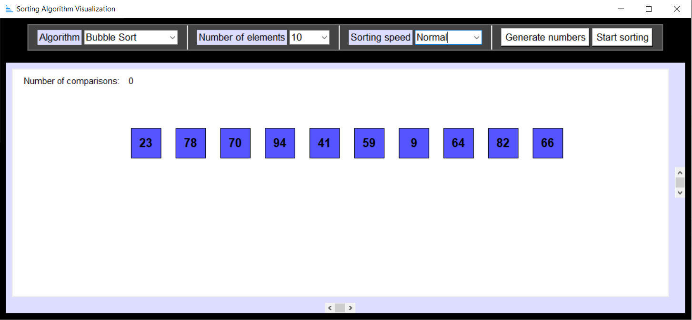

# Visualize Sorting
tkinter-GUI for visualizing the procedure of different sorting algorithms.


## Versions
Tested with Python 3.9.5

## Usage
```
$ python visualize_sorting.py
```

1. Select the sorting algorithm 
2. Select the number of elements
3. Select the sorting speed
4. Generate a sequence of numbers
5. Start sorting

## Sources

#### Icons
The icons used in the GUI are from [ICONS8](https://icons8.com/)